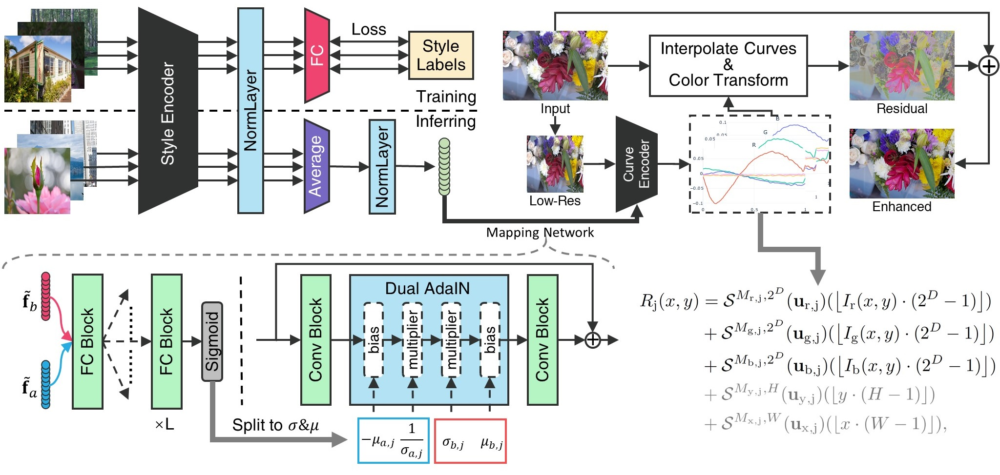

# StarEnhancer

**[StarEnhancer: Learning Real-Time and Style-Aware Image Enhancement](https://arxiv.org/abs/2107.12898) (ICCV 2021 Oral)**

**Abstract:** 
Image enhancement is a subjective process whose targets vary with user preferences.
In this paper, we propose a deep learning-based image enhancement method covering multiple tonal styles using only a single model dubbed StarEnhancer.
It can transform an image from one tonal style to another, even if that style is unseen.
With a simple one-time setting, users can customize the model to make the enhanced images more in line with their aesthetics.
To make the method more practical, we propose a well-designed enhancer that can process a 4K-resolution image over 200 FPS but surpasses the contemporaneous single style image enhancement methods in terms of PSNR, SSIM, and LPIPS.
Finally, our proposed enhancement method has good interactability, which allows the user to fine-tune the enhanced image using intuitive options.



## Getting started

### Install

We test the code on PyTorch 1.8.1 + CUDA 11.1 + cuDNN 8.0.5, and close versions also work fine.

- Install PyTorch and torchvision fom [http://pytorch.org](http://pytorch.org).
- Install other requirements:

```sh
pip install -r requirements.txt
```

We mainly train the model on RTX 2080Ti * 4, but a smaller mini batch size can also work.

### Prepare

You can generate your own dataset, or download the one we generate.

The final file path should be the same as the following:

```
┬─ save_model
│   ├─ stylish.pth.tar
│   └─ ... (model & embedding)
└─ data
    ├─ train
    │   ├─ 01-Experts-A
    │   │   ├─ a0001.jpg
    │   │   └─ ... (id.jpg)
    │   └─ ... (style folder)
    ├─ valid
    │   └─ ... (style folder)
    └─ test
        └─ ... (style folder)
```

#### Download

Data and pretrained models are available on [GoogleDrive](https://drive.google.com/drive/folders/1RZpzNuyCcZVBALW3xZMvF-UhOD6xjFz3?usp=sharing).

#### Generate

1. Download raw data from [MIT-Adobe FiveK Dataset](https://data.csail.mit.edu/graphics/fivek/).
2. Download the modified Lightroom database `fivek.lrcat`, and replace the original database with it.
3. Generate dataset in JPEG format with quality 100, which can refer to this [issue](https://github.com/dvlab-research/DeepUPE/issues/26).
4. Run `generate_dataset.py` in `data` folder to generate dataset.

### Train

Firstly, train the style encoder:

```sh
python train_stylish.py
```

Secondly, fetch the style embedding for each sample in the train set:

```sh
python fetch_embedding.py
```

Lastly, train the curve encoder and mapping network:

```sh
python train_enhancer.py
```

### Test

Just run:

```sh
python test.py
```

Testing LPIPS requires about 10 GB GPU memory, and if an OOM occurs, replace the following lines

```python
lpips_val = loss_fn_alex(output * 2 - 1, target_img * 2 - 1).item()
```

with

```python
lpips_val = 0
```

## Notes

Due to agreements, we are unable to release part of the source code. 
This repository provides a pure python implementation for research use.
There are some differences between the repository and the paper as follows:

1. The repository uses a ResNet-18 w/o BN as the curve encoder's backbone, and the paper uses a more lightweight model.
2. The paper uses CUDA to implement the color transform function, and the repository uses `torch.gather` to implement it.
3. The repository removes some tricks used in training lightweight models.

Overall, this repository can achieve higher performance, but will be slightly slower.
